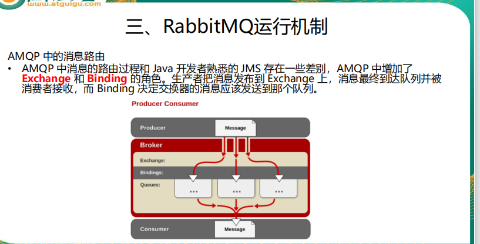

  
   
    
 
 
  
   
    
     
     
     
    Docker安装rabbitmq的管理版
    docker run -d  -p 5672:5672  -p 15672:15672 --name myrabbitmq imagename/imageid
    访问rabbitmq的管理界面地址：http://192.168.0.113:15672/ 
    
    
    direct 模式一对一模式
    fanout 广播形式
    topic  交换器通过模式匹配分配消息的路由键属
          性，将路由键和某个模式进行匹配，此时队列
          需要绑定到一个模式上。它将路由键和绑定键
          的字符串切分成单词，这些单词之间用点隔开。
          它同样也会识别两个通配符：符号“#”和符号
          “*”。#匹配0个或多个单词，*匹配一个单词。
 
  
   
 